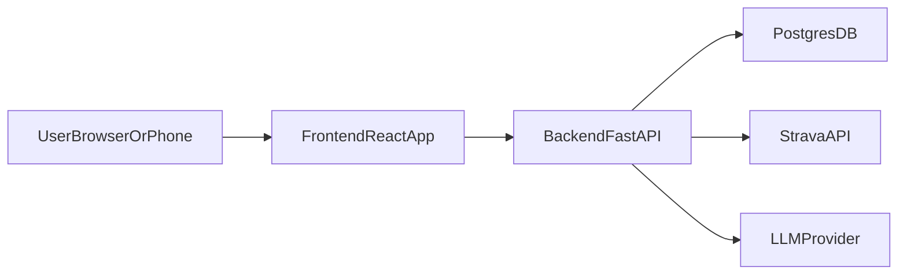

# Strava Analytics

This project is a full-stack Strava analytics web app with a **Python/FastAPI backend**, **React + TypeScript frontend**, and **AI-powered insights** over your Strava data.

The app is designed to be **mobile-friendly** and can later be turned into a PWA so you can add it to your phone’s home screen.

## Project Structure

```text
strava-analytics/
├── .github/
│   └── workflows/           # CI/CD workflows
├── backend/                 # FastAPI backend (Python)
│   ├── app/
│   └── requirements.txt
├── frontend/                # React + TypeScript (Vite) web app
├── .env.example             # Example environment variables (do NOT commit .env)
├── .gitignore
└── README.md
```

## Tech Stack

- **Backend**: FastAPI, SQLModel/SQLAlchemy, PostgreSQL, httpx
- **Frontend**: React, TypeScript, Vite, Tailwind CSS (planned)
- **AI**: External LLM provider (e.g., OpenAI) via backend service
- **CI/CD**: GitHub Actions, deployment to Render (staging & production)

## Getting Started (High Level)

1. **Clone the repo** and copy `.env.example` to `.env`, filling in:
   - `STRAVA_CLIENT_ID`, `STRAVA_CLIENT_SECRET`
   - `DATABASE_URL`
   - `AI_PROVIDER`, `AI_API_KEY`
2. **Backend**:
   - Create and migrate the PostgreSQL database (details to come).
   - Install dependencies from `backend/requirements.txt`.
   - Run the FastAPI app with Uvicorn.
3. **Frontend**:
   - Initialize the Vite React app in `frontend/` (steps will be added once scaffolded).
   - Configure the backend API base URL via env variables.

## Architecture Overview



## Git Workflow

This repository uses a simple three-branch workflow:

- **`main`**: production-ready code.
- **`staging`**: pre-production testing and release candidates.
- **`develop`**: integration branch for day-to-day development.

Recommended flow:

1. Create feature branches from `develop`, e.g. `feature/strava-oauth`.
2. Open PRs from feature branches into `develop`.
3. Periodically promote from `develop` → `staging` via PR for end-to-end testing.
4. Once validated, promote from `staging` → `main` via PR to release to production.

Branch protection rules (configure in GitHub repository settings):

- Require PRs and green CI checks for `staging` and `main`.
- Disallow direct pushes to `staging` and `main`.
- Optionally enforce squash merges for a cleaner history.

More detailed setup instructions and workflows will be fleshed out as the implementation progresses.